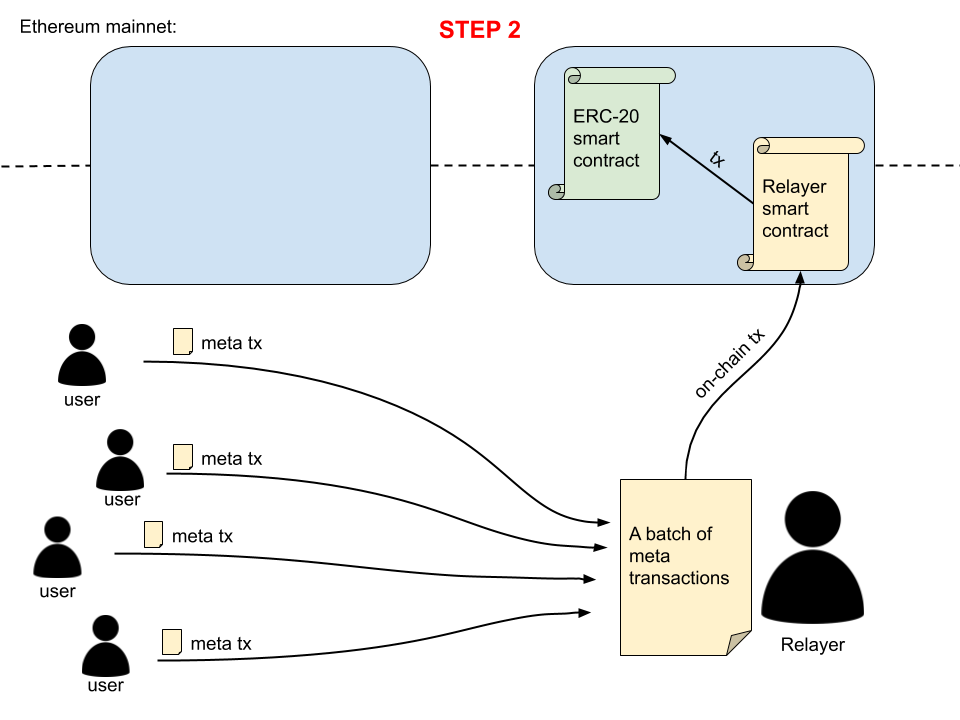

# A proof-of-concept for batching meta transactions from multiple users

## The problem

When you say "meta transactions" people think of **gasless** transactions, which means that someone else (the relayer) makes an on-chain token transaction for you and pays for it in Ether. In return, you can pay the relayer in tokens (instead of Ether).

The problem with the current implementations of meta transactions is that it allows the relayer to either:

A) Relay **only one meta tx at a time**. While this allows the original (meta) tx sender to avoid using ETH, it doesn't lower the transaction cost for her/him, because the relayer has to be compensated in tokens in approx. the same (or higher) value as the gas fees for the on-chain transaction.

B) Relay **multiple** meta txs from a **single user** as defined in [EIP-1776](https://github.com/wighawag/singleton-1776-meta-transaction). This helps with reducing the cost per transaction, but it's not a common occurence (that one user would want to send multiple txs at once).

## The solution

The solution is to **batch** meta transactions **from multiple senders** into **one on-chain transaction**.

This would **lower the cost** of a meta tx for a common user.

## The implementation

The implementation should be pretty straightforward. A user sends a meta transaction to a relayer. Relayer waits for multiple meta txs to come up in a mempool until the meta tx fees (at least) cover the cost of the on-chain gas fee.

You can see the basic proof-of-concept in this file: [ERC20MetaBatch.sol](https://github.com/defifuture/batching-meta-transactions/blob/master/contracts/ERC20MetaBatch.sol). This is an extended ERC-20 contract with an added meta tx batch transfer capabilities (see function `transferMetaBatch()`).

### What if the relayer forges a meta tx?

Every meta tx should be digitaly signed with a user's Ethereum private key. The token smart contract must then check the validity of a signature (`ecrecover()`).

### What if the relayer sends the same meta tx twice (replay attack)?

The meta tx must include a nonce. Hence the token smart contract must somehow do validation based on the nonce.

Perhaps the easiest would be to keep a **separate mapping for nonces** only:

```solidity
// hashmap of meta tx nonces for each address. New nonce must be always bigger.
mapping(address => uint256) private __nonceOf;
```

Another option is to have a 2D array of a token value and a meta tx nonce (mapped to user's address):

```solidity
// mapping of address => tokenAmount => metaTxNonce
mapping(address => mapping(uint256 => uint256)) private __balanceOf;
```

Every time a meta transaction is completed, the smart contract should update the latest nonce in the mapping. The rule should be that a new meta tx must not have a nonce lower than the previous meta tx (of the same user/address). This way it's easier to check the validity of nonces.

### What data is needed in a meta tx?

- sender address (the user who is sending the meta tx)
- receiver address
- token amount to be transfered - uint256
- relayer fee (in tokens) - uint256
- nonce - uint256
- hash (hash of the values above: sender address, receiver address, token amount, relayer fee, nonce) - bytes32
- signature (comes in three parts):
  - sigV - uint8
  - sigR - bytes32
  - sigS - bytes32

### How is the data (about meta txs) sent to the smart contract?

When a relayer receives multiple meta txs and decides to make a batch on-chain transaction, the data needs to be sent to the smart contract in a way that takes the least amount of gas.

In web development, the data would be sent in a JSON format. But since Solidity does not have a JSON parser (and parsing data on-chain would also be quite expensive), the data could be sent as arrays instead (to avoid parsing a huge string of data).

Currently, it seems that the best approach is the one that is used by [Disperse](https://github.com/banteg/disperse-research/blob/master/contracts/Disperse.sol), which means sending each type of meta data as a **separate array**. One array would consist of sender addresses, the other of receiver addresses, and then 7 more arrays for a token amount, a relayer fee, a nonce, a hash (bytes32 array) and signature arrays.

The crucial part here is that the data in arrays must be in the **correct order**. If the ordering is wrong, the smart contract would notice that (because hashes wouldn't match) and abort the change.

Example:

```solidity
function transferMetaBatch(address[] memory senders, 
                           address[] memory recipients, 
                           uint256[] memory amounts,
                           uint256[] memory relayer_fees,
                           uint256[] memory nonces,
                           bytes32[] memory hashes,
                           uint8[] memory sigV,
                           bytes32[] memory sigR,
                           bytes32[] memory sigS) public returns (bool) {
    //... function code ...
}
```

An alternative is to use `pragma experimental ABIEncoderV2;` and send data in as an object (as a Struct).

### What is the relayer fee?

The meta tx sender defines how big fee they want to pay to the relayer.

### How can the sender know which relayer to pay the fee to?

The sender does not know that because there are probably multiple relayers that can pick the meta tx and relay it on-chain.

Instead, the token smart contract will take care of this. The smart contract knows who the relayer is (`msg.sender`) and can then give the relayer the appropriate amount of tokens based on all the relayer fees in all the meta txs (in that on-chain tx).

### Can a relayer pass meta transactions to different token contracts in one on-chain tx?

Not sure about that, probably not. But if we're talking about a token that has a lot of transactions, this shouldn't be a problem. Otherwise the relayer might want to wait longer until the sufficient amount of meta txs (for a certain token) join the mempool.

### Where is the mempool?

The relayers should sync mempools between each other, although because they are competing, this might not happen.

As a solution, there could be nodes that only serve as mempool holders. Not sure how to incentivise them, though (maybe the big dApps maintainers like Synthetix and Aave would want to run them).

Another option could be that the meta tx sender sends the meta tx to many relayers at once.

### What if there's a meta tx in a relayer's batch that was already sent on-chain by some other relayer?

First of all, the on-chain transaction as a whole should not fail in this case. The already commited meta tx should just be ignored by the smart contract processing the batch. The other (not-yet-commited) meta txs should go through.

Secondly, some people have pointed out the lost revenue that a relayer has if one or more meta txs in their batch were already spent. While this is true, I don't think those relayers should be compensated for lost meta tx fees (as some have proposed). The problem is that if they are compensated, the relayers would try to take advantage of this and start to intentially include already spent meta txs in their batches.

Instead, the solution to this problem should be done on the relayer network level. One option is to solve this issue in the mempool. The mempool could have threads (or queues) - one for each relayer. Mempool would then act as a load balancer, transfering meta txs equally to each queue. 

This would not prevent a relayer from taking a meta tx from another queue - in fact, if a relayer sees that another relayer is ignoring/censoring a meta tx, they should be encouraged to pick that meta tx up (or a mempool could automatically reassign the meta tx to someone else after some time). But in case a relayer acts maliciously and is "stealing" meta txs from other queues, other relayers could kick that relayer out of the network.

### What about approve and allowance?

This proof-of-concept only targets the basic token transfer functionality, so the approve txs are not needed here (might be added later). But it should work in a similar way.

### Does this approach need a new type of a token contract standard, or is a basic ERC-20 enough?

This approach would need a **extended ERC-20 token standard** (we could call it **ERC20MetaBatch**). This basically means adding a couple of new functions to ERC-20 that would allow relayers to change the token amount for users under the condition the meta tx signatures (made by original senders) are valid. This way meta tx senders don't need to trust relayers.

Here's an image how the whole system (using ERC20MetaBatch token standard) would work:


Note that the image above is a simplified overview that's missing some crucial information like:

- meta txs first go to a mempool from where they are picked by relayers
- every meta tx is digitally signed by a user (using their Ethereum private key)
- relayer parses meta txs and sends the data on-chain in a form of multiple data arrays as smart contract function parameters
- the smart contract checks the validity of each meta tx (checks a signature)

### Is it possible to somehow use the existing ERC-20 token contracts?

This might be possible if all relayers make the on-chain transactions via a special smart contract (which then sends multiple txs to token smart contracts). But this special smart contract would need to have a token spending approval from every user (for each token separately), which would need to be done on-chain.

In this case, the process would look like this:




The disadvantage of this process is that a user first needs to do an on-chain transaction, before being able to do off-chain meta transactions. But luckily, the on-chain transaction needs to be made only once per token (if the allowance amount is unlimited, of course).

### What about the `permit()` function?

`permit()` is a very nice function that provides a new functionality to the ERC-20 standard - Basically it means that a user can give a **token-spending approval** to someone else using a **meta transaction** (off-chain). This solves the problem from the **previous question** (a user having to make an on-chain approval transaction first).

For more information see [EIP-2612: permit – 712-signed approvals](https://eips.ethereum.org/EIPS/eip-2612).

### How to handle the burn address (0x0)

The burn address should be able to **receive** tokens, but it must **not be able to send** tokens (as [suggested here](https://github.com/ethereum/EIPs/issues/1776#issuecomment-467460341)).
